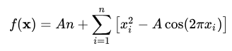

# Projeto: Algoritmo Genético (DEAP) - Otimização da Função Rastrigin

## Função de Satrigin

Na *otimização matemática*, a **função Rastrigin** é uma *função não-convexa* usada como um problema de teste de desempenho para *algoritmos* de *otimização*. É um exemplo típico de função multimodal não-linear. Foi proposto pela primeira vez em 1974 por Rastrigin como uma função de 2 dimensões e foi generalizado por Rudolph.  A versão generalizada foi popularizada por Hoffmeister & Bäck e Mühlenbein. Encontrar o mínimo desta função é um problema bastante difícil devido ao seu grande espaço de busca e seu grande número de *mínimos locais*.

Sobre um n-domínio dimensional é definido por:



onde A = 10 e xi pertence [-5.12, 5.12]. Há muitos extremos:

- O mínimo global está em **x = 0** onde **f(x) = 0**
- O valor máximo da função para xi pertencente [-5.12, 5.12] está localizado em **x = (+- 4.52299366..., +-4.52299366...)**

Mais informações técnicas sobre a função Rastrigin retiradas de [Wikipedia – Rastrigin function](https://en.wikipedia.org/wiki/Rastrigin_function)

## Descrição Projeto

Este projeto tem como objetivo treinar **Algoritmos Genéticos (AG)**, implementando e utilizando o framework **[DEAP](https://deap.readthedocs.io/en/master/)** para **otimização da função Rastrigin**, um problema clássico de minimização em otimização contínua.

O objetivo é encontrar o **melhor indivíduo** (conjunto de variáveis) que minimize o valor da função, testando estratégias evolutivas do tipo:

- **μ + λ** (sobrevivência dos pais e filhos);
- **μ, λ** (sobrevivência apenas dos filhos).

O projeto inclui geração automática de gráficos e salvamentos de resultados.

## Funcionalidades

- Configuração de parâmetros de AG em arquivo separado (`config.py`);
- Modularização da função fitness (`functions.py`);
- Seed aleatória para reprodutibilidade;
- População contínua com mutação gaussiana e cruzamento de dois pontos;
- Estatísticas por geração (mínimo e média de fitness);
- Gráfico de convergência;
- Salvamento automático de resultados em `.txt` e `.png;`
- Suporte a múltiplas todadas (`TRIALS`) e registro do **melhor indivíduo global.**

## Estrutura do Projeto

```
RastriginFunctionOptimization/
│
├─ utils/
│   ├─ functions.py      # Função Rastrigin
│   └─ config.py         # Parâmetros do AG
│
├─ main.ipynb            # Notebook principal de execução
├─ results/              # Pasta gerada automaticamente para salvar resultados e gráficos
├─ LICENSE		 # License MIT
├─ .gitignore		 
├─ requirements.txt	 # Arquivo .txt com as bibliotecas neessárias para rodas o projeto
└─ README.md             # Este arquivo
```

## Como Executar

- Clone o projeto com `git clone https://github.com/Joao-gui/RastriginFunctionOptimization.git` ou baixe o arquivo `.zip` e extraia o projeto.
- Abra a pasta do projeto em sua IDE de preferência
- **Recomendavel** criai ambiente virtual para rodar o projeto, utilizando o `venv` ou o `conda`. Mas caso deseja pode rodas sem um abiente virtual criado.
- Para instalação das biliotecas utilizadas pelo projeto utilizar o `pip install -r requirements.txt`
- Executar o arquivo `main.ipynb`, e ajustar os parâmetros em `config.py` se necessário
- Caso deseja mudar o modo de **μ + λ** para **μ, λ**, apenas troque `USE_PLUS_STRATEGY` de `True` para `False`
- Resultados serão salvos na pasta `results/`, onde:
  - um arquivo `resultados.txt` com os resultados:
    - Data e hora da execução;
    - Estratégia do algorítimo (μ + λ ou μ, λ);
    - Melhor run;
    - melhor indivíduo;
    - Melhor fitness;
  - um arquivo `nome_do_gráfico.png` com o gŕafico do melhor indivíduo salvo no arquivo `.txt`

## Configurações

Parâmetros principais em `config.py`

**Parâmetro**					**Descrição**

---

`POP_SIZE`						Tamanho da população

---

`N_GER`						Número de gerações

---

`PROB_CX`						Probabilidade de cruzamento

---

`PROB_MT`						Probabilidade de mutação

---

`SEED`							Semente aleatória (para reprodutibilidade)

---

`TRIALS`						Número de rodadas do algoritmo

---

`IND_SIZE`						Dimensão de indivíduo (número de variáveis)

---

`BOUND_LOW`					Limite inferior (Rastrigin)

---

`BOUND_UP`						Limite superior (Rastrigin)

---

`MU`							Numero de pais

---

`_LAMBDA`						Numero de filhos

---


## Observações

- O projeto é **modular** e facilmente adaptável para outros problemas de otimização contínua.
- Como dito anteriormente, é possível alternar entre **estratégias evolutivas** μ + λ e μ, λ alterando a variável `USE_PLUS_STRATEGY`.
- Permiete acompanhar a evolução do melhor indivíduo global ao longo de várias execuções.

---


## Licença

Este projeto está disponível sob a **MIT License** - veja o arquivo `LICENSE` para mais detalhes.

---

## Agradecimentos

Conforme dito anteriormente no início, é um projeto para treinamento e estudo com intuíto de por em prática o conhecimento adquirido e buscar por mais ao decorrer do projeto, é um projeto simples porém com bastante conhecimento pratico e teórico. Agradeço a todos e caso queirão compartilhar conhecimento ou sujestões, podem me achar pelos meus contatos que estão logo abaixo.

---


## Autor

**João Guilherme Pellacani** - Engenheiro Elétrico com foco em Inteligência Artificial.

[LinkedIn](https://www.linkedin.com/in/joao-guilherme-pellacani/) | [GitHub](https://github.com/Joao-gui)

“The best way to predict the future is to invent it.” – **Alan Kay**
